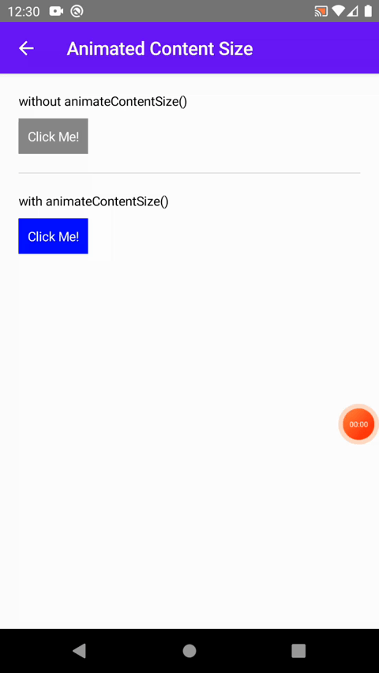
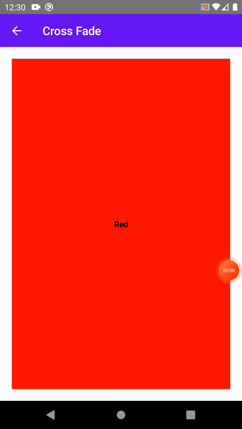
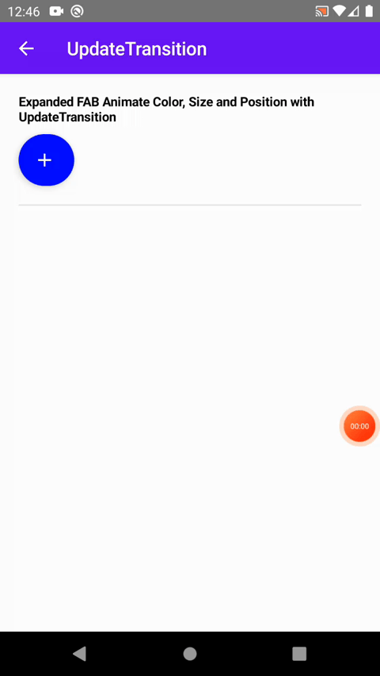
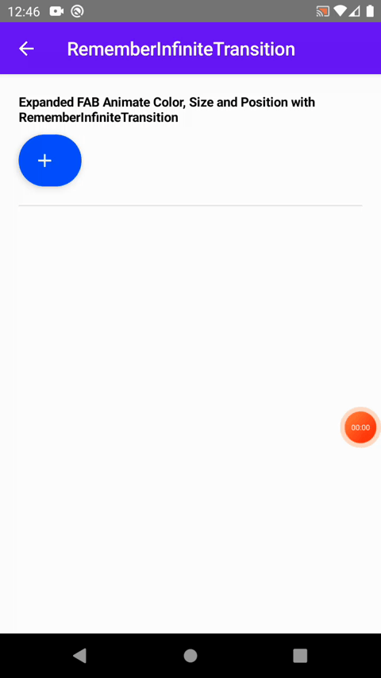
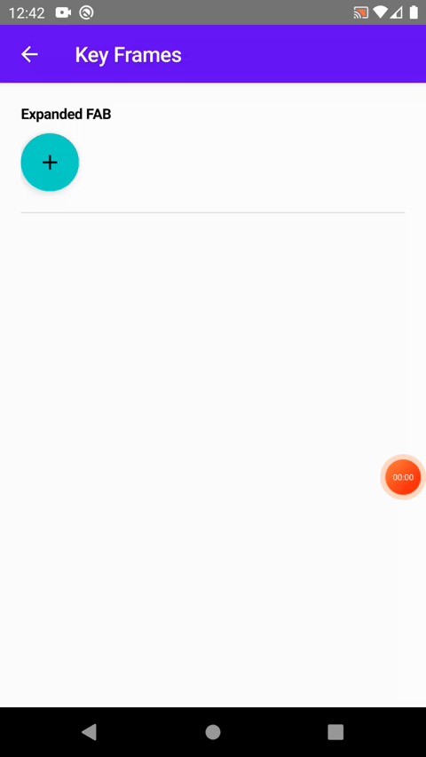
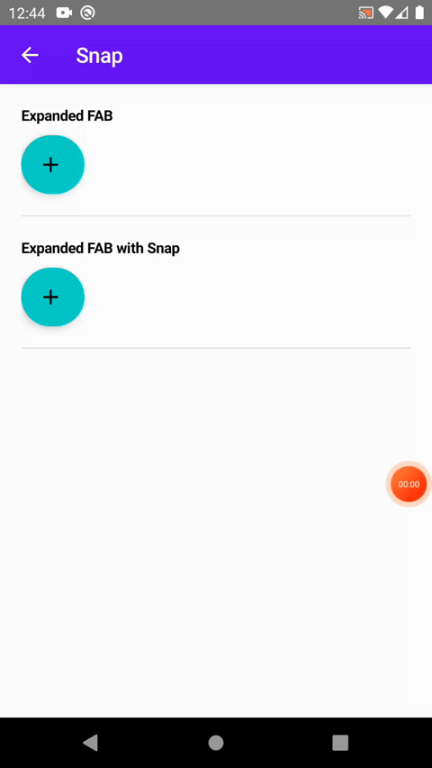

<!--
*** Thanks for checking out this README Template. If you have a suggestion that would
*** make this better, please fork the repo and create a pull request or simply open
*** an issue with the tag "enhancement".
*** Thanks again! Now go create something AMAZING! :D
-->

<!-- PROJECT SHIELDS -->
<!--
*** I'm using markdown "reference style" links for readability.
*** Reference links are enclosed in brackets [ ] instead of parentheses ( ).
*** See the bottom of this document for the declaration of the reference variables
*** for contributors-url, forks-url, etc. This is an optional, concise syntax you may use.
*** https://www.markdownguide.org/basic-syntax/#reference-style-links
-->

<!-- PROJECT LOGO -->
<br />
<p align="center">
  <a href="https://github.com/othneildrew/Best-README-Template"></a>

  <h1 align="center">Jetpack Compose Animation Playground</h1>

  <p align="center">
    This is a project of me playing with <a href="https://developer.android.com/jetpack/compose/animation">Jetpack Compose Animation</a>.
  </p>
</p>

<p align="center">
    <h3 align="center">High-Level APIs</h3>
    <table>
      <tr>
        <td></td>
        <td></td>
        <td></td>
      </tr>
      <tr>
        <td align="center">animatedVisibility</td>
        <td align="center">animatedContentSize</td>
        <td align="center">crossFade</td>
      </tr>
    </table>
    <br>
    <h3 align="center">Low-Level APIs</h3>
    <table>
        <tr>
            <td></td>
            <td></td>
            <td></td>
        </tr>
        <tr>
            <td align="center">animateAsState</td>
            <td align="center">updateTransition</td>
            <td align="center">rememberInfiniteTransition</td>
        </tr>
    </table>
    <br>
    <h3 align="center">Animation Specs</h3>
    <table>
        <tr>
            <td></td>
            <td></td>
            <td></td>
        </tr>
        <tr>
            <td align="center">spring</td>
            <td align="center">tween</td>
            <td align="center">keyframes</td>
        </tr>
        <tr>
            <td></td>
            <td></td>
            <td></td>
        </tr>
        <tr>
            <td align="center">repeatable</td>
            <td align="center">infiniteRepeatable</td>
            <td align="center">snap</td>
        </tr>
    </table>
</p>

<!-- TABLE OF CONTENTS -->
## Table of Contents

* [Built With](#built-with)
* [Contributing](#contributing)
* [License](#license)
* [Contact](#contact)
* [Acknowledgements](#acknowledgements)

## Built With
* [Kotlin](https://kotlinlang.org/)
* [Androidx](https://developer.android.com/jetpack/androidx)
* [Jetpack Compose](https://developer.android.com/jetpack/compose)

<!-- CONTRIBUTING -->
## Contributing

1. Fork the Project
2. Create your Feature Branch (`git checkout -b feature/AmazingFeature`)
3. Commit your Changes (`git commit -m 'Add some AmazingFeature'`)
4. Push to the Branch (`git push origin feature/AmazingFeature`)
5. Open a Pull Request


<!-- LICENSE -->
## License

```
MIT License

Copyright (c) 2021 Anang Kurniawan

Permission is hereby granted, free of charge, to any person obtaining a copy
of this software and associated documentation files (the "Software"), to deal
in the Software without restriction, including without limitation the rights
to use, copy, modify, merge, publish, distribute, sublicense, and/or sell
copies of the Software, and to permit persons to whom the Software is
furnished to do so, subject to the following conditions:

The above copyright notice and this permission notice shall be included in all
copies or substantial portions of the Software.

THE SOFTWARE IS PROVIDED "AS IS", WITHOUT WARRANTY OF ANY KIND, EXPRESS OR
IMPLIED, INCLUDING BUT NOT LIMITED TO THE WARRANTIES OF MERCHANTABILITY,
FITNESS FOR A PARTICULAR PURPOSE AND NONINFRINGEMENT. IN NO EVENT SHALL THE
AUTHORS OR COPYRIGHT HOLDERS BE LIABLE FOR ANY CLAIM, DAMAGES OR OTHER
LIABILITY, WHETHER IN AN ACTION OF CONTRACT, TORT OR OTHERWISE, ARISING FROM,
OUT OF OR IN CONNECTION WITH THE SOFTWARE OR THE USE OR OTHER DEALINGS IN THE
SOFTWARE.
```

<!-- CONTACT -->
## Contact

Anang Kurniawan
<p>
    <a href="https://www.linkedin.com/in/anangkur">LinkedIn</a> •
    <a href="https://medium.com/@anangk97">Medium</a> •
    <a href="https://dribbble.com/anangkur">Dribbble</a> •
    <a href="https://twitter.com/anang_kur">Twitter</a> •
    <a href="https://instagram.com/anang.kur">Instagram</a>
</p>

<!-- ACKNOWLEDGEMENTS -->
## Acknowledgements
- [Jetpack Compose - Animation (developer.android.com)](https://developer.android.com/jetpack/compose/animation)
- [Animation CrossFade by Foso (foso.github.io)](https://foso.github.io/Jetpack-Compose-Playground/animation/crossfade/)
- [Compose Animation by BadassDev (badassdev.io)](https://badassdev.io/compose-animation/)
- [Jetpack Compose for Games and Animation by Wajahat Karim (speakerdeck.com)](https://speakerdeck.com/wajahatkarim3/jetpack-compose-for-games-and-animations?slide=4)
- [Animate with Jetpack Compose Animate as State and Animation Specs (proandroiddev.com)](https://proandroiddev.com/animate-with-jetpack-compose-animate-as-state-and-animation-specs-ffc708bb45f8)
- [Animations in Jetpack Compose by Rasul Aghakishiyev (proandroiddev.com)](https://proandroiddev.com/animations-in-jetpack-compose-bbeaa886210e)

<!-- MARKDOWN LINKS & IMAGES -->
<!-- https://www.markdownguide.org/basic-syntax/#reference-style-links -->
[contributors-shield]: https://img.shields.io/github/contributors/othneildrew/Best-README-Template.svg?style=flat-square
[contributors-url]: https://github.com/othneildrew/Best-README-Template/graphs/contributors
[forks-shield]: https://img.shields.io/github/forks/othneildrew/Best-README-Template.svg?style=flat-square
[forks-url]: https://github.com/othneildrew/Best-README-Template/network/members
[stars-shield]: https://img.shields.io/github/stars/othneildrew/Best-README-Template.svg?style=flat-square
[stars-url]: https://github.com/othneildrew/Best-README-Template/stargazers
[issues-shield]: https://img.shields.io/github/issues/othneildrew/Best-README-Template.svg?style=flat-square
[issues-url]: https://github.com/othneildrew/Best-README-Template/issues
[license-shield]: https://img.shields.io/github/license/othneildrew/Best-README-Template.svg?style=flat-square
[license-url]: https://github.com/othneildrew/Best-README-Template/blob/master/LICENSE.txt
[linkedin-shield]: https://img.shields.io/badge/-LinkedIn-black.svg?style=flat-square&logo=linkedin&colorB=555
[linkedin-url]: https://linkedin.com/in/othneildrew


